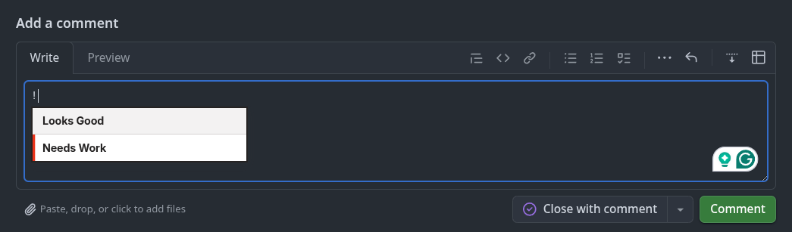
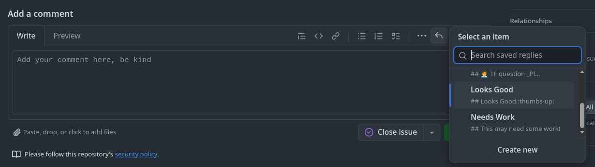
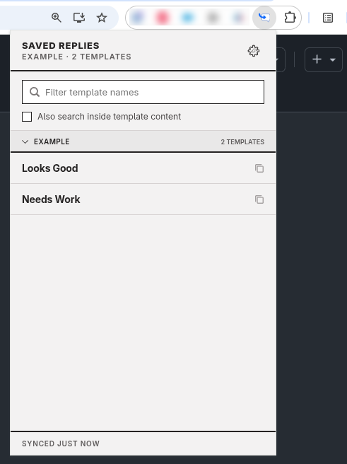
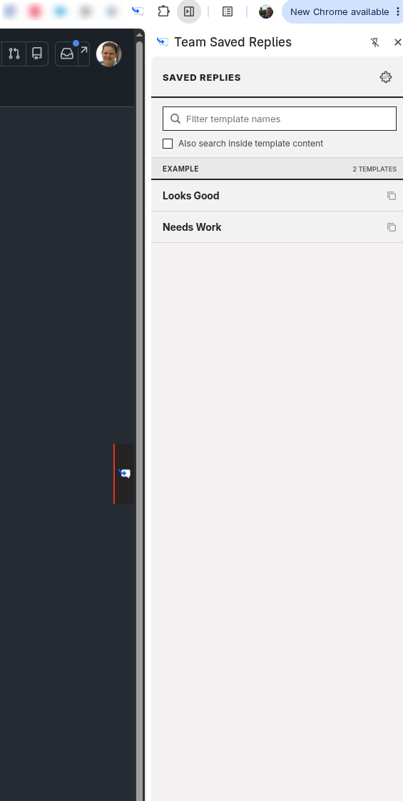
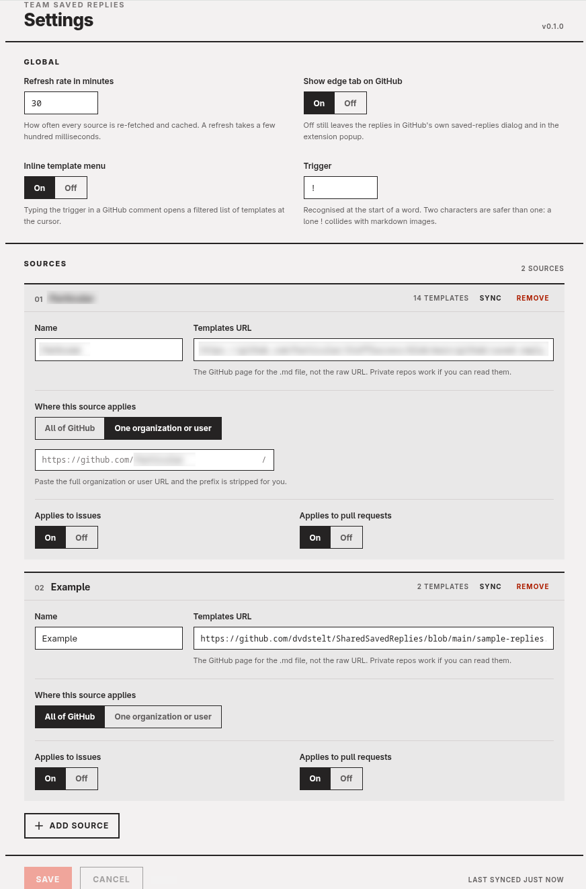

# Team Saved Replies

GitHub's saved replies are personal. Everyone on a team ends up writing their own version of the same answer, and over time they drift apart.

Team Saved Replies keeps them in one markdown file in a repository you already have. Anyone who can read that file gets the same replies, and when someone improves one, everyone picks it up on the next refresh.

Type `!` in any comment box and the templates are right there:



Keep typing to narrow the list, press Enter to insert. The list is ordered by what you use most, so the reply you reach for daily is usually the first one. The trigger can be changed or switched off in settings.

## Where the templates show up

Four places, so you can reach them whichever way suits what you are doing.

**As you type.** The `!` menu above. The fastest route once you know your templates by name.

**In GitHub's own saved replies dialog**, alongside your personal ones, on issues and pull requests.



**In the extension popup**, as a searchable list. Click a row to copy it to the clipboard. Search covers template names; tick the box to search inside the content too.



**In a side panel**, with what you used recently at the top, grouped by repository. Clicking a row inserts it into the comment box you are writing in, or copies it if there isn't one.



On Chrome the tab on the edge of the page opens and closes the panel, and you can drag it wherever you want it. **Firefox has no edge tab**: it only opens a sidebar from a keyboard shortcut, a toolbar button or a menu entry, never from a click inside the page. Open it there with `Ctrl+Shift+Y`, or by right-clicking a comment box and choosing "Toggle saved replies".

## Writing the templates

Templates live in a markdown file in a GitHub repository. The format is a heading for the name, then a fenced code block for the reply itself:

<pre>
# Our team's saved replies

These replies are used by our team to keep our communication consistent.

## Work Started
```markdown
&lt;!-- Fill out the following information --&gt;

## 🚀 Work Started

### 📝 High level plan

&lt;!-- Anything useful for others reading this comment --&gt;

### ⏲ Update schedule

&lt;!-- How often do you plan to communicate updates? --&gt;
```

## Work Completed
```markdown
## 🎉 Work Complete

&lt;!-- Related issues, pull requests, or anything else worth knowing --&gt;
```
</pre>

The extension looks for that pattern: an `##` heading followed by a fenced code block. Anything else in the file, including instructions for whoever maintains it, is ignored. Put as many replies in one file as you like.

Commit it and note the URL of the file's page on GitHub. Private repositories work: the extension fetches the page using your own GitHub session, so anyone who can already read the repository gets the templates.

## Installing

Currently submitted for review in Chrome extensions store.

## Configuring it

Open the settings from the gear in the popup or the side panel.



**Refresh rate** is how often every source is re-fetched. **Show edge tab on GitHub** controls the tab on the edge of the page, on Chrome. **Inline template menu** and **Trigger** control the `!` menu.

Then add a source for each template file:

- **Name** is what appears as the group heading in the lists.
- **Templates URL** is the GitHub page for the `.md` file, not the raw URL.
- **Where this source applies** is either all of GitHub, or a single organisation or user. Paste a full organisation URL and the prefix is stripped for you.
- **Applies to issues** and **Applies to pull requests** decide which kinds of page it shows up on.

Add as many sources as you like. A source scoped to your own organisation and one for an open source project you maintain can sit side by side without getting in each other's way.

**Sync** on a source fetches it immediately and reports what came back, so you can check a URL works before committing to it. Changes are only stored when you press **Save**.

## Security and privacy

Nothing is collected and nothing is sent anywhere. See [the privacy policy](docs/privacy-policy.md) for exactly what is stored and the single network request the extension makes, and [the security policy](SECURITY.md) for how to report a vulnerability.

## Credits

Team Saved Replies is a fork of [awright18/SharedSavedReplies](https://github.com/awright18/SharedSavedReplies) by Adam Wright. It carries the changes from [awright18/SharedSavedReplies#34](https://github.com/awright18/SharedSavedReplies/pull/34), which added injection into GitHub's native saved replies dialog on both issue and pull request pages.
